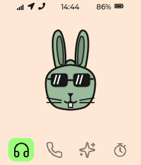
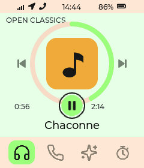
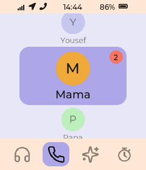
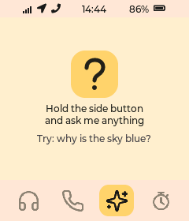
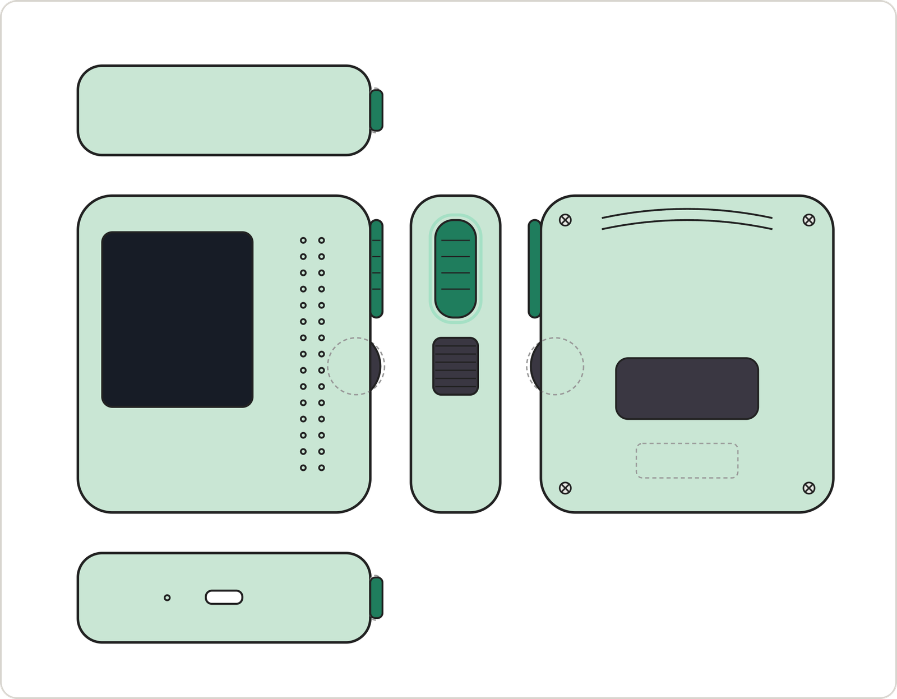
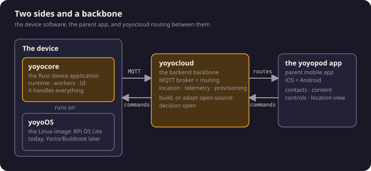

<div align="center">

<picture>
  <source media="(prefers-color-scheme: dark)" srcset="docs/brand/logo/png/yoyopod-cream-1024.png">
  
</picture>

### The first device before a smartphone

A parent-managed music player and phone for kids ages 7-14.<br>
Family calls, voice notes, music and podcasts, and a small screen that stays calm.<br>
No feed, no ads, no strangers.

[**Join the waitlist**](https://yoyopod.com) · [**Docs**](https://docs.yoyopod.com) · [**One-pager**](docs/product/ONE_PAGER.pdf) · [**Roadmap**](docs/ROADMAP.md)

<p align="center">


</p>

<p align="center">


</p>

<p align="center">


</p>

</div>

---

## The vision

Childhood deserves a device of its own. Parents want their kids to have independence, communication, and safety; they should not have to hand over distraction, social media, and addictive screens to get it. yoyopod is the category between the toy and the smartphone: a complete family system where kids carry a focused device for calls, voice notes, and their own music, and parents hold the contact list, the content, and the map. Kids get real independence. Parents get peace of mind.

The timing is ours to take: schools across Europe are pushing phones out of classrooms, parents are organizing to delay the first smartphone, and no one has built the device families actually want to hand a kid instead.

Five convictions shape everything we build:

- **Contact-first communication.** No dial pad, no open address book. The only people a kid can call are the people a parent chose.
- **Local-first listening.** Music and stories live on the device and play with zero connectivity. The cloud is an import path, not a dependency.
- **A screen that stays calm.** Song titles and names, not videos. Every session ends on purpose: the call finishes, the story finishes, the kid goes back out the door.
- **Small, finite tools instead of apps.** A watch face, a stopwatch, a flashlight. Useful, bounded, done.
- **No camera, no browser, no app store.** Absences built into the device, not settings.

## The build

<table>
<tr>
<td width="340" align="center">
  
</td>
<td>

yoyopod is built hardware-first: the software in this repository powers the device end to end, from the LVGL screen and the one-button interaction model to playback, calls, and power management, on a Raspberry Pi Zero 2W with a 240x280 display, speaker, and microphone.

The build advances pillar by pillar:

| Area | Status |
| --- | --- |
| **Listen** (local music, playlists, podcasts) | running on the device today |
| **Talk** (whitelist calls and voice notes) | built, hardware validation next |
| **Pocket tools** (watch face, stopwatch, flashlight) | running on the device today |
| **Ask** (push-to-talk questions, answer disclosed as AI) | prototyped |
| **Locate** (live-ish location for parents) | designed, engineering next |
| **Parent app** | designed, next up |

The engineering build is tracked in the open in [docs/ROADMAP.md](docs/ROADMAP.md).

</td>
</tr>
</table>

| Home | Now Playing | Talk | Ask |
| :---: | :---: | :---: | :---: |
|  |  |  |  |

<sub>One button: tap = next, double-tap = open, hold = talk or back.</sub>

## Where it's going



The V2 industrial design study: 72 x 78 x 22 mm, a glowing push-to-talk pill, a detented scroll wheel, a repairable four-screw shell, four finishes. Documented end to end, from [orthographic drawings](docs/hardware/enclosure/) to [3D models](docs/hardware/enclosure/v2/model/) to a [24-second concept video](docs/product/PRODUCT_VIDEO.mp4) and the [customer one-pager](docs/product/ONE_PAGER.pdf).

## How it's built



| Component | What it is | Today |
| --- | --- | --- |
| **yoyoOS** | the Linux image the device boots | Raspberry Pi OS Lite; a minimal custom image is the target |
| **yoyocore** | the Rust application on top: one runtime supervising single-purpose worker processes, surfaced as four peer engines (UI, Media, VoIP, Speech) | runs the device today |
| **yoyocloud** | the backend backbone: MQTT, provisioning, telemetry routing | device-side link and provisioning built; build-or-adopt decision for the backbone in progress |
| **the yoyopod app** | the parent mobile app, iOS + Android | designed, next up |

Inside yoyocore every message is one newline-framed JSON envelope with a strict schema stamp, and the process tree is the architecture: if one engine fails, the others keep running. The kid's music does not stop because a modem hiccupped.

| Directory | What lives there |
| --- | --- |
| [`device/`](device/) | the Rust runtime plus UI, media, VoIP, network, cloud, power, and speech workers |
| [`cli/`](cli/) | the `yoyopod` operator CLI for dev-machine to Pi orchestration |
| [`docs/`](docs/README.md) | canonical documentation: product, architecture, hardware, operations |
| [`docsite/`](docsite/) | the rendered documentation sites |
| [`pitch/`](pitch/) | the product pitch deck |
| [`deploy/`](deploy/) | Pi install scripts and systemd units |
| [`apps/`](apps/) | reserved for the future parent web and mobile apps |

For the architecture view, start with [WORK_AREAS.md](docs/architecture/WORK_AREAS.md) and [SYSTEM_ARCHITECTURE.md](docs/architecture/SYSTEM_ARCHITECTURE.md).

## Run it yourself

This repo is Raspberry Pi hardware-first: plan around a Pi Zero 2W, the current Whisplay-based prototype HAT, and optionally the SIM7600 modem path for 4G/GPS work.

```bash
# Build the Rust operator CLI (single binary `yoyopod`):
cargo build --manifest-path cli/Cargo.toml --release

# Build the Rust runtime locally (or use CI artifacts):
cargo build --manifest-path device/Cargo.toml --release -p yoyopod-runtime
```

On a fresh Pi, install the dev/prod lane structure:

```bash
curl -fsSL https://raw.githubusercontent.com/attmous/yoyopod/main/deploy/scripts/install_pi.sh | sudo -E bash -s --
```

Then deploy a branch to the device in one step from your dev machine:

```bash
yoyopod target mode activate dev
yoyopod target deploy --branch <branch>
```

`target deploy` pushes the branch, finds the matching CI artifact, syncs the Pi, installs binaries, restarts the service, and verifies startup. Deeper flows: [Contributor Workflow](docs/operations/CONTRIBUTOR_WORKFLOW.md), [Development Guide](docs/operations/DEVELOPMENT_GUIDE.md), [Pi Dev Workflow](docs/operations/PI_DEV_WORKFLOW.md), and [Dev/Prod Lanes](docs/operations/DEV_PROD_LANES.md). Code is the source of truth.

## Built in the open

yoyopod is built by software-engineer fathers in Baden-Württemberg, Germany, and proven at their own dinner tables. The whole build is public: the [roadmap](docs/ROADMAP.md) tracks the engineering build in the open, the [docs site](https://docs.yoyopod.com) lays out both today's system and the full product vision, and every device ships with a right to its own source.

Want to follow along or help? [Join the waitlist](https://yoyopod.com), open an [issue](https://github.com/attmous/yoyopod/issues), or start with the [contributor workflow](docs/operations/CONTRIBUTOR_WORKFLOW.md).

## License

yoyopod is licensed under the **GNU Affero General Public License v3.0 or later** (AGPLv3+). See [LICENSE](LICENSE) for the full text.

The project's own source could be permissively licensed in isolation, but yoyopod's VoIP backend links [liblinphone](https://gitlab.linphone.org/BC/public/liblinphone), which is itself AGPLv3 (with a paid commercial-license alternative from Belledonne Communications). Distributed binaries that include the liblinphone link therefore fall under AGPLv3 as a combined work.

In practical terms:

- The full source is published in this repository.
- Anyone receiving a yoyopod device or firmware artifact is entitled to the corresponding source under the same license.
- Modifications and derivative works must remain AGPLv3 and must publish their source.

Section 13 of the AGPL ("network use") triggers source-disclosure for software that interacts with users remotely over a network. yoyopod's typical use (a local user holding the device) does not trigger that clause; a hypothetical future cloud companion that exposes liblinphone functionality remotely would.
