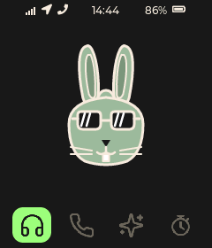
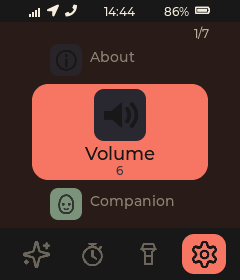
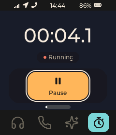
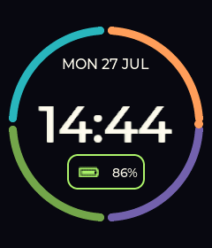
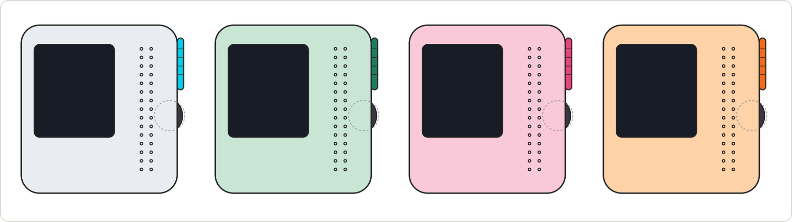

<div align="center">

<picture>
  <source media="(prefers-color-scheme: dark)" srcset="docs/brand/logo/png/yoyopod-cream-1024.png">
  
</picture>

### The first device before a smartphone

A parent-managed music player and phone for kids ages 7-14.<br>
Family calls, voice notes, music and podcasts, and a small screen that stays calm.<br>
No feed, no ads, no strangers.

[**Join the waitlist**](https://yoyopod.com) · [**Docs**](https://docs.yoyopod.com) · [**One-pager**](docs/product/ONE_PAGER.pdf) · [**Roadmap**](docs/ROADMAP.md)

<p align="center">


</p>

<p align="center">


</p>

</div>

---

## The working prototype

<table>
<tr>
<td width="340" align="center">
  <br>
  <sub>Captured from the running prototype via <code>yoyopod target screenshot</code></sub>
</td>
<td>

yoyopod is built hardware-first. The prototype in this repository runs today on a Raspberry Pi Zero 2W with a 240x280 screen, a speaker, a microphone, and one physical side button. What works, works on real hardware; the table below says plainly what does not yet. No emulated demos, no fabricated UI.

Where every part of the product stands right now:

| Area | Status |
| --- | --- |
| **Listen** (local music, playlists, podcasts) | working on today's hardware |
| **Talk** (whitelist calls and voice notes) | built, being validated on hardware |
| **Pocket tools** (watch face, stopwatch, flashlight) | working on today's hardware |
| **Ask** (push-to-talk questions, answer disclosed as AI) | early prototype |
| **Locate** (live-ish location for parents) | designed, not wired end to end |
| **Parent app** | designed, not built yet |

The table above is the product summary; the detailed engineering ledger of what is broken in the build and deploy path today lives in [docs/ROADMAP.md](docs/ROADMAP.md).

</td>
</tr>
</table>

| Home | Now Playing | Talk | Ask |
| :---: | :---: | :---: | :---: |
|  |  |  |  |

| Home, dark | Setup, dark | Stopwatch, dark | Watch face |
| :---: | :---: | :---: | :---: |
|  |  |  |  |

<sub>Every kid picks a companion for the home screen (this one chose the bunny). The UI ships light and dark themes, a nav bar, and an ambient watch face; screens here are rendered by the same UI engine that runs on the device, driven headless in this repo's mock harness. The interaction model is deliberate: a wheel of screens, one side button, and gestures a seven-year-old can learn in a minute (tap = next, double-tap = open, hold = talk or back).</sub>

## Why it exists

Parents want their kids to have independence, communication, and safety. They don't want to hand over distraction, social media, and addictive screens to get it. yoyopod gives a kid a focused device for family calls, voice notes, and their own music, while parents keep the contact list and settings in their hands. Kids get real independence. Parents get peace of mind. And the moment is real: schools across Europe are pushing phones out of classrooms while more parents organize to delay the first smartphone, yet there is no good first device to hand a kid instead.

What that means in the software:

- **Contact-first communication.** No dial pad, no open address book. The only people the device can call are the contacts a parent provisions; screening of incoming calls is part of the Talk validation work in flight now.
- **Local-first listening.** Music and stories live on the device and play with zero connectivity. The cloud is an import path, not a dependency.
- **A screen that stays calm.** Song titles and names, not videos. Every session ends on purpose: the call finishes, the story finishes, the kid goes back out the door.
- **Small, finite tools instead of apps.** The newest additions to the on-device UI are a watch face, a stopwatch with a soft control tray, and a flashlight. That is the shape of the roadmap: useful, bounded, done.
- **No camera, no browser, no app store.** Absences built into the device, not settings.

## Where it's going



<sub>The V2 enclosure study drawn flat, front view in all four finishes: Cloud·Sky, Mint·Forest, Bubblegum, and Tangerine. An industrial design study, not shipped hardware; today's prototype is a 3D-printed shell around off-the-shelf boards.</sub>

The target device keeps the same soul with purpose-built hardware: 72 x 78 x 22 mm, a glowing push-to-talk pill, a detented scroll wheel, a repairable four-screw shell. The study is documented end to end, from [orthographic drawings](docs/hardware/enclosure/) to [3D models](docs/hardware/enclosure/v2/model/) to a [24-second concept video](docs/product/PRODUCT_VIDEO.mp4) and the [customer one-pager](docs/product/ONE_PAGER.pdf).

## How it's built

A Rust workspace where one runtime supervises seven single-purpose worker processes over a shared protocol crate. If one engine fails, the others keep running; the kid's music does not stop because a modem hiccupped.

| Directory | What lives there |
| --- | --- |
| [`device/`](device/) | the Rust runtime plus UI, media, VoIP, network, cloud, power, and speech workers |
| [`cli/`](cli/) | the `yoyopod` operator CLI for dev-machine to Pi orchestration |
| [`docs/`](docs/README.md) | canonical documentation: product, architecture, hardware, operations |
| [`docsite/`](docsite/) | the rendered documentation sites |
| [`pitch/`](pitch/) | the product pitch deck |
| [`deploy/`](deploy/) | Pi install scripts and systemd units |
| [`apps/`](apps/) | reserved for the future parent web and mobile apps |

For the architecture view, start with [WORK_AREAS.md](docs/architecture/WORK_AREAS.md) and [SYSTEM_ARCHITECTURE.md](docs/architecture/SYSTEM_ARCHITECTURE.md).

## Run it yourself

This repo is Raspberry Pi hardware-first: plan around a Pi Zero 2W, the current Whisplay-based prototype HAT, and optionally the SIM7600 modem path for 4G/GPS work.

```bash
# Build the Rust operator CLI (single binary `yoyopod`):
cargo build --manifest-path cli/Cargo.toml --release

# Build the Rust runtime locally (or use CI artifacts):
cargo build --manifest-path device/Cargo.toml --release -p yoyopod-runtime
```

On a fresh Pi, install the dev/prod lane structure:

```bash
curl -fsSL https://raw.githubusercontent.com/attmous/yoyopod/main/deploy/scripts/install_pi.sh | sudo -E bash -s --
```

Then deploy a branch to the device in one step from your dev machine:

```bash
yoyopod target mode activate dev
yoyopod target deploy --branch <branch>
```

`target deploy` pushes the branch, finds the matching CI artifact, syncs the Pi, installs binaries, restarts the service, and verifies startup. Deeper flows: [Contributor Workflow](docs/operations/CONTRIBUTOR_WORKFLOW.md), [Development Guide](docs/operations/DEVELOPMENT_GUIDE.md), [Pi Dev Workflow](docs/operations/PI_DEV_WORKFLOW.md), and [Dev/Prod Lanes](docs/operations/DEV_PROD_LANES.md). When docs disagree, trust current code and the most recently merged PRs.

## Built in the open

yoyopod is being built by software-engineer fathers in Baden-Württemberg, Germany, and tested at their own dinner tables. The whole build is public: the [roadmap](docs/ROADMAP.md) states plainly what works and what is broken, the [docs site](https://docs.yoyopod.com) separates today's reality from the target design, and every device ships with a right to its own source.

Want to follow along or help? [Join the waitlist](https://yoyopod.com), open an [issue](https://github.com/attmous/yoyopod/issues), or start with the [contributor workflow](docs/operations/CONTRIBUTOR_WORKFLOW.md).

## License

yoyopod is licensed under the **GNU Affero General Public License v3.0 or later** (AGPLv3+). See [LICENSE](LICENSE) for the full text.

The project's own source could be permissively licensed in isolation, but yoyopod's VoIP backend links [liblinphone](https://gitlab.linphone.org/BC/public/liblinphone), which is itself AGPLv3 (with a paid commercial-license alternative from Belledonne Communications). Distributed binaries that include the liblinphone link therefore fall under AGPLv3 as a combined work.

In practical terms:

- The full source is published in this repository.
- Anyone receiving a yoyopod device or firmware artifact is entitled to the corresponding source under the same license.
- Modifications and derivative works must remain AGPLv3 and must publish their source.

Section 13 of the AGPL ("network use") triggers source-disclosure for software that interacts with users remotely over a network. yoyopod's typical use (a local user holding the device) does not trigger that clause; a hypothetical future cloud companion that exposes liblinphone functionality remotely would.
